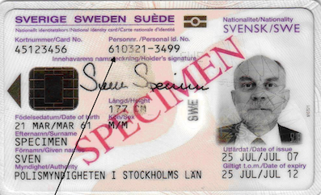

# Swedish ID Number
The personal identity number (Swedish: personnummer) is the Swedish national identification number

QA requires dataset and if you live in Sweden, you are nothing without Swedish ID number.

# GeneratedSwedishID
If you are reading this you have come across the point that you need Valid Swedish IDs to test your application.Then, you are in the right place my friend 🖖🏻!!

### Java Code to Generate Valid Swedish ID
    Copy  and run generateSwedishID()

### JavaScript Code to Generate Valid Swedish ID

### Validate the generated Swedish ID here:
  https://codepen.io/LasseStilvang/pen/WrLKbb

